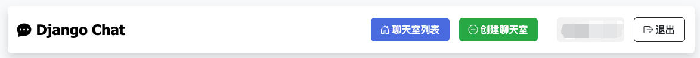
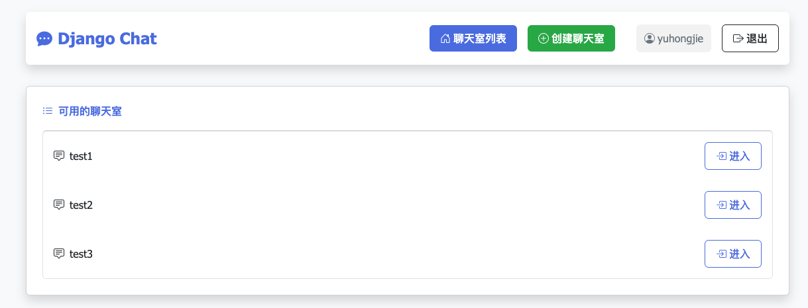
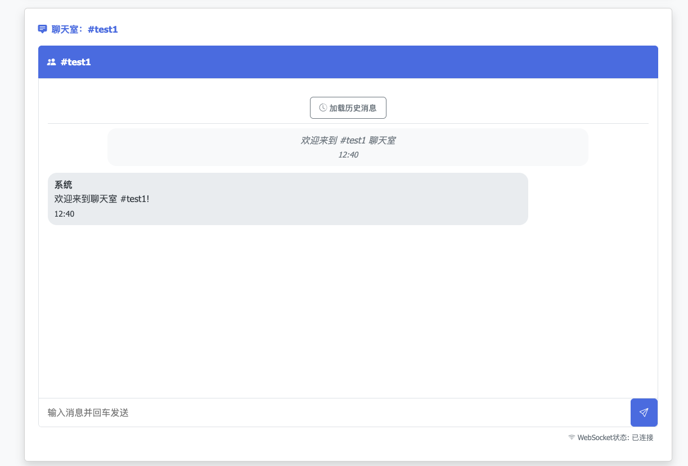

# Django Chat - 实时聊天应用



## 上海大学课程项目：
基于 Django 框架框架的聊天室网站设计:利用Django框架，搭建基于B/S模式的网络聊天室，功能包括但不限于:系统登陆、创建聊天室、进入聊天室以及聊天等功能，鼓励学生在上述功能基础上进行创新与深化。

Django Chat 是一个基于 Django 和 WebSockets 的实时聊天应用，支持多个聊天室、用户认证以及历史消息记录。应用采用了现代化的UI设计，提供流畅的用户体验。

## 🌟 功能特点

- ✅ 用户注册和登录系统
- ✅ 多聊天室支持，可创建和加入不同的聊天室
- ✅ 基于 WebSockets 的实时消息传递
- ✅ 消息持久化存储和历史记录查询
- ✅ 美观的响应式用户界面，适配各种设备
- ✅ 消息发送状态和连接状态显示
- ✅ 自动重连机制
- ✅ 支持 `/roll` 指令随机掷骰子

## 🖼️ 应用截图

### 聊天室列表


### 聊天界面


## 🛠️ 技术栈

- **后端**: Django 4.2+
- **WebSocket**: Django Channels 4.0+
- **前端**: HTML, CSS, JavaScript
- **UI组件**: Bootstrap 5 和 Bootstrap Icons
- **数据库**: SQLite (可扩展至其他数据库)

## 📦 安装和运行

### 前提条件

- Python 3.8+
- pip

### 安装步骤

1. 克隆仓库
   ```bash
   git clone https://github.com/您的用户名/django-chat.git
   cd django-chat
   ```

2. 创建并激活虚拟环境
   ```bash
   python -m venv venv
   # Windows
   venv\Scripts\activate
   # macOS/Linux
   source venv/bin/activate
   ```

3. 安装依赖
   ```bash
   pip install -r requirements.txt
   ```

4. 执行数据库迁移
   ```bash
   python manage.py migrate
   ```

5. 启动开发服务器
   ```bash
   python manage.py runserver
   ```

6. 访问应用
   在浏览器中打开 http://127.0.0.1:8000

### 或使用快速运行脚本

```bash 
bash run.sh
```

## 📝 使用方法

1. 注册新账号或使用已有账号登录
2. 在主页查看可用聊天室列表
3. 点击"创建聊天室"按钮创建新的聊天室
4. 点击聊天室旁的"进入"按钮进入聊天室
5. 在输入框输入消息并按回车或点击发送按钮发送消息
6. 查看历史消息：
   - 点击聊天室顶部的"加载历史消息"按钮
   - 或向上滚动至消息区域顶部自动加载更多历史消息

## 🔧 自定义和配置

可以在 `settings.py` 文件中修改以下配置：

- 数据库设置
- 时区设置
- 日志配置
- Channels 配置（可选择换用 Redis 作为 Channel Layer）

## 🌐 生产环境部署

对于生产环境，建议：

1. 设置 `DEBUG = False`
2. 更换为正式的 `SECRET_KEY`
3. 使用更强大的数据库（如 PostgreSQL）
4. 使用 Redis 作为 Channel Layer
5. 配置 HTTPS
6. 使用 Daphne 或 Uvicorn 作为 ASGI 服务器

## 📄 许可证

[MIT License](LICENSE)

## 🤝 贡献

欢迎提交 Issue 和 Pull Request 来完善此项目。

## 📧 联系方式

yuhongjie@shu.edu.cn

---

感谢使用 Django Chat！ 

如果你觉得这个项目对你有帮助，欢迎给个 ⭐Star 支持一下，让更多人看到它！
